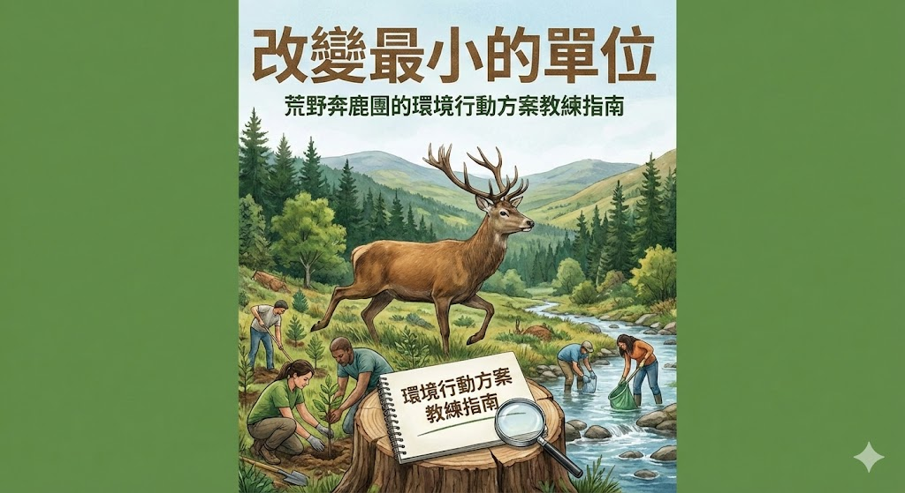

### 前言

感謝高三團楠木校長，給我機會在高鹿七基的課程中，帶領這一堂關於行動方案的課。

這本《改變最小的單位：荒野奔鹿團的環境行動方案教練指南》，是我依據自己對行動方案的理解與實務經驗，再加上強力助手 ChatGPT 的協力完成的成果。行動方案，從「被帶著做」到「自己推得動」，當中的辛苦，只有真正身在其中的人才明白。而讓人願意撐下去的理由，其實始終只有一個——希望親子團裡的每一個孩子，都能在這個歷程中長成，成為社會的助力，而不是阻力。

我相信，沒有任何一套訓練方法是絕對最好、絕對有效的。但唯有大人願意學習「放手」與「引導」，孩子才有機會真正蛻變。奔鹿是一個很有趣、也很關鍵的階段：孩子從懵懵懂懂走向自主，從順從服從慢慢長出自我意識，過程中一定充滿衝突與挫折。透過行動方案，我們只是先找一個不算太大的目標，陪孩子一起完成；在這個過程中，他們學會做事的方法、團隊合作的方式、面對衝突的協調與妥協。當孩子知道自己「在往一個目標前進」，成就感與自信就會一點一滴累積起來。

這份文件的目的，其實很單純：把我這幾年累積的心得與想法整理下來。我不是環教專家，也不是專職教育工作者，只是一個憑著熱忱、願意多走幾步路的大人。其中提到的案例，是根據 2025 年環境行動論壇少年組（奔鹿團）參加隊伍的行動方案，做了一些簡單的分析與詮釋，純屬個人觀點。對我來說，行動方案從來沒有「好」或「不好」，只要願意踏出去、願意試著做一點改變，就已經在讓這個世界變得更美麗。

在這裡也想特別向一路相挺的夥伴們致上深深的感謝：

感謝高三團楠木校長，在面對學員可能退訓的壓力下，仍然願意讓我放手推動。

感謝總團陪伴南三月亮，在我徬徨、疑惑的時候，給了我很多鼓勵與支持。

感謝高三團獵戶座，從答應擔任副團長的那一刻起，我想他心裡應該後悔過很多次，卻依然陪我一起扛，包含偕同擔任這次課程的講師。

感謝高三團黃腹琉璃，在我擔任副團長期間，全力支持我在奔鹿團推動行動方案。

感謝總團陪伴嘉一番薯校長，在嘉鹿三基課程中，願意支持我把行動方案真正帶進課程。

感謝高鹿七基所有辛苦的工人夥伴們，尤其是每一位導引員，有你們撐著，學員們才可能有這樣的學習經歷。

最後，也要向高三團，以及所有曾經聽我滔滔不絕談論行動方案的夥伴們說聲：謝謝你們，辛苦了。

高三團 灰鷽 敬上

---

# [目錄]

## 第一部　思維重塑：從「愛地球」到「和議題做長期關係」
#### [第一章　不是多做一場活動，而是陪一個地方走一年](chapter01.md)
#### [第二章　小鹿的心理位置：在「想被看見」和「覺得自己很小」之間](chapter02.md)
#### [第三章　場域與系統：不只看到「這裡很糟」，而是看見背後的結構](chapter03.md)

## 第二部　行動路徑：四階段 × 五類議題的實作框架
#### [第四章　一年一輪：7 月到隔年 7 月的行動節奏圖](chapter04.md)
#### [第五章　啟動與感受：先讓小鹿「喜歡在這裡」，行動才有地方長](chapter05.md)
#### [第六章　聚焦與研究：從「好多想法」走到「今年就陪這一題」](chapter06.md)
#### [第七章　發想與原型：先做一個「ㄟ，好像行得通」的版本](chapter07.md)
#### [第八章　實踐與擴散：把一年「跑完」，而不是在台上「演完」](chapter08.md)

## 第三部　引導者工具箱：導引員與大鹿怎麼站好位置
#### [第九章　導引員是教練，不是超人家教](chapter09.md)
#### [第十章　問對問題的力量——用 ORID 和小鹿好好說話](chapter10.md)
#### [第十一章　鷹架怎麼搭——給得剛好，不搶走主導權](chapter11.md)
#### [第十二章　小隊衝突與分工不均——讓摩擦變成合作練習場](chapter12.md)
#### [第十三章　失敗教育——當方案不如預期，真正的學習才開始](chapter13.md)
#### [第十四章　導引員也需要電池——資源網與自我照顧](chapter14.md)

## 第四部 不只表現好不好：陪小鹿一起讀懂自己的成長
#### [第十五章　看見看不見的成果——行動方案不能只看「表現好不好」](chapter15.md)
#### [第十六章　歷程檔案怎麼做——讓小鹿看見自己做過的每一小步](chapter16.md)
#### [第十七章　Rubrics 怎麼設計——不是打分數，而是幫孩子看見「能力漸層」](chapter17.md)
#### [第十八章　影響力怎麼看——數字之外，還能怎麼說「有用」？](chapter18.md)

## 第五部　實戰故事集：九支小隊的行動練習簿
#### [案例一 挖篩小隊：從一把沙子，挖出看不見的塑膠世界](case01.md)
#### [案例二 菸末小隊：從一根菸蒂開始的街頭談判課](case02.md)
#### [案例三 森聲不息：用《早安婆羅洲》把遠方雨林帶到孩子的早餐桌前](case03.md)
#### [案例四 甩廢！海有希望：把淨灘，變成從小開始的源頭教育](case04.md)
#### [案例五 魚翔碧水，生態重光：讓原生魚回到校園水池的那一年](case05.md)
#### [案例六 「油」我真好：從油羅溪邊坡開始的山村垃圾談判課](case06.md)
#### [案例七 簡的六次方：從撿垃圾，到過一個比較簡單的日子](case07.md)
#### [案例八 木箱有點菜：從廢棧板，到一座會長菜的小森林](case08.md)
#### [案例九 珊瑚大白話：從防曬乳到氣候變遷，讓小鹿看見「看不見的受傷」](case09.md)
#### [案例總結  從九支小隊到你的行動方案：把故事變成工具箱](casesummary.md)
